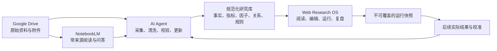

# 个人投研操作系统产品设计

> [!important] 产品定位
> 这是一个面向个人长期研究的投研操作系统（Research OS），不是单纯的知识库、数据看板或一张巨大的行为树。它把资料、结构化事实、因子状态、因果模型、行为树、运行快照和复盘结果组织成一个可追溯、可扩展、可维护的产品。

## 设计目标

产品要解决的不是“把更多资料放在一起”，而是让使用者在三个月或一年后仍能快速回答：

- 当前对一个行业的判断是什么？
- 这个判断依赖哪些证据和因果链？
- 哪些条件会推翻它？
- 相比上一次运行，什么发生了变化？
- 过去判断错误时，错在数据、因子、因果模型、情景、决策还是执行？

方法论边界沿用[[个人投资因果决策框架]]：数据层提供事实，因子层描述状态，推演层维护因果模型与情景，决策层由行为树和风险规则控制流程。产品层负责把这些对象以不同视图呈现出来，不重新发明一套投资逻辑。

## 总体形态

产品采用“一个核心模型、四种工作视图”的结构。底层对象只有一份，网页只是对同一份对象提供阅读、编辑、运行和复盘入口。



### 工具职责边界

| 工具 | 负责什么 | 不负责什么 |
|---|---|---|
| Google Drive | 保存报告、财报、政策、PDF、原始表格和网页归档 | 不承载因果模型和决策规则 |
| NotebookLM | 对指定资料做带来源的阅读、问答、对比和矛盾提取 | 不直接生成正式投资结论 |
| AI Agent | 抓取、清洗、指标更新、证据抽取、规则运行和复盘草稿 | 不擅自修改历史快照和风险边界 |
| Markdown、SQLite、Parquet、Git | 保存稳定知识、结构化实体、时间序列和版本 | 不作为临时聊天记录堆放处 |
| Web 应用 | 统一的阅读、编辑、运行和复盘入口 | 不作为原始资料唯一存储地 |
| Obsidian/Wiki | 保存稳定方法论、概念和长期知识 | 不替代日常运行界面 |

单人系统初期使用 Markdown、SQLite 和 Parquet 足够，不需要先引入复杂的分布式数据库。关键不是技术规模，而是对象有稳定 ID、来源有版本、判断有快照。

## 四种工作视图

### 研究总览

研究总览是默认入口，面向快速恢复上下文。每个主题只展示当前状态、条件性判断、置信度、三个主要驱动、最大不确定性、最近更新和下一次检查时间。

总览不展示所有指标，避免变成信息墙。它只回答“现在怎么看、为什么这么看、什么时候重看”。

### 行业专题

专题页是一个主题的完整工作台，例如房地产、新能源汽车或具身机器人。推荐使用三栏布局：

```text
左侧：因子状态      中间：因果关系图      右侧：情景与当前判断
底部：历史运行、证据变化和复盘时间线
```

因子卡片至少显示方向、强度、时滞、置信度、适用范围、最近更新时间、证据数量和反转条件。因果图表达“什么通过什么机制影响什么”，不是普通思维导图。情景卡片必须包含成立条件、传导路径、可观察信号和失效条件。

### 行为树运行

行为树页面展示一次研究运行的执行过程，而不是永久展开一张大图。典型流程是：数据完整性检查、指标刷新、因子状态刷新、情景生成、竞争解释比较、反证条件检查、输出条件性判断。

页面要显示当前执行节点、通过或失败的条件、对应证据、下一步分支和本次运行使用的版本。`Sequence` 表示前置条件全部满足，`Parallel` 表示多个分支同时刷新，`Selector` 表示选择合规的下一条路径；这些节点不是经济指标投票器。

### 复盘校准

复盘页把历史快照、后续事实和误差归因放在同一时间线上。每次运行都冻结数据版本、因子状态、因果模型、行为树规则、情景、判断、行动和下一次复核时间。

到期后，系统将实际结果和快照比较，并将偏差归因到数据、因子、因果、情景、决策或执行层。新版本只能追加和修订，不能覆盖过去的判断。

## 行业专题页的阅读顺序

用户打开房地产专题时，默认按以下顺序恢复上下文：

1. 当前判断：基准、向好、压力三个情景分别是什么。
2. 关键驱动：哪些因子正在改变，方向和置信度如何。
3. 因果路径：因子通过哪些机制影响销售、价格、投资或现金流。
4. 证据链：每个关键因子对应哪些指标和原始来源。
5. 失效条件：出现什么事实后必须降低置信度或重建模型。
6. 历史变化：与上一次运行相比，判断、证据和模型改了什么。

任何结论都应支持“为什么”展开，最终追溯到原始文件、指标定义、计算方法、因子解释、模型版本和反证条件。

## 核心对象

产品只围绕少量稳定对象构建：

| 对象 | 作用 |
|---|---|
| Topic | 研究主题，如房地产、汽车、机器人或单只股票 |
| Source | 原始文件、网页、报告或数据接口 |
| Evidence | 从来源中抽取的可引用事实 |
| Metric | 有定义、单位、频率和计算方法的指标 |
| Factor | 由多个证据支持的可解释状态变量 |
| Relation | 因子、结果和机制之间的有向关系 |
| Scenario | 一组前提、路径、信号和失效条件 |
| Rule | 行为树节点和风险约束 |
| Run Snapshot | 某个时间点不可覆盖的完整研究运行 |
| Observation | 快照之后用于验证的实际结果 |
| Review | 对偏差和模型问题的归因及修订建议 |

这些对象通过稳定 ID 连接，页面和图表由对象生成，不在多个页面手工复制同一事实。

## 可维护性规则

- 一条事实只保留一个权威位置，其他页面通过链接或查询引用。
- 事实、解释、判断和行动分开存储，不能把观点伪装成数据。
- 每个正式判断必须绑定数据版本、模型版本、规则版本和运行时间。
- AI 产出先进入待审核状态，经过来源核验后才能进入正式研究库。
- 历史快照只读；数据修订通过新版本表达，并记录对旧判断的影响。
- 默认显示结论和变化，细节通过展开、跳转和证据链访问。
- 行业判断和资产配置决策分开，避免行业看好直接变成买入指令。
- 证据不足时，系统可以正式输出“暂不判断”或“保留竞争假设”。

## 版本路线

### V0.1：单主题闭环

只实现房地产一个主题，手工导入少量可信资料，建立指标、因子、因果关系和一棵研究行为树，完成一次运行快照和一次复盘。

### V0.2：可维护的研究工作台

增加来源管理、指标时间序列、因子编辑、因果图展示、版本差异和历史快照对比。此阶段先保证可追溯和可复盘，不追求自动化覆盖率。

### V0.3：Agent 辅助更新

让 Agent 执行资料发现、数据更新、口径检查、证据候选抽取和复盘草稿生成；所有正式变更仍需人工确认。

### V1.0：多主题与资产决策分层

扩展到宏观、新能源汽车、具身机器人、医药和个股，并增加独立的估值、流动性、仓位和风险行动树。

## V0.1 验收标准

- 五分钟内能够看懂一个主题当前的判断和主要变化。
- 任意判断都能沿证据链追溯到来源、指标、因子和情景。
- 任意历史判断都能还原当时的输入、模型、规则和行动。
- 新数据能明确说明改变了哪个因子、情景和行为路径。
- 复盘能区分数据、模型、规则和执行问题。
- 增加第二个行业时，不需要重写核心对象和页面结构。

相关页面：[[个人投资因果决策框架]]、[[理财研究体系/index|理财研究体系]]、[[行业研究/index|行业研究]]
