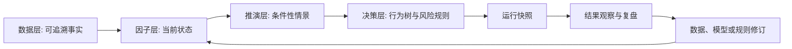

# 个人投资因果决策框架

> [!important] 框架定义
> 这是一个把原始信息转化为可追溯、可证伪、可复盘的条件性判断，并在风险边界内指导下一步行动的个人投研框架。它不承诺预测唯一正确的未来，也不默认自动交易。

## 目标与边界

框架要解决的问题是：将阅读、数据、专家观点和个人经验从零散印象，沉淀为能解释“为什么”、能被新事实推翻、能持续修订的研究系统。

它适用于中国宏观、行业、公司和资产研究。不同领域替换数据、因子模板和因果机制；证据治理、情景推演、行为树门禁和复盘机制保持一致。

框架不把相关性当因果，不把许多相互关联的指标当作多张独立选票，也不以一两次结果验证或否定一条长期机制。

## 四层结构

| 层次 | 核心问题 | 负责产出 | 严格边界 |
|---|---|---|---|
| 数据层 | 实际观察到了什么？ | 来源、数据记录、可复算指标 | 不解释趋势，不产生观点 |
| 因子层 | 市场现在处于什么状态？ | 因子的方向、强度、时滞、置信度 | 不直接预测结果，不重复计权 |
| 推演层 | 在不同条件下可能如何发展？ | 因果链、竞争解释、情景、可证伪判断 | 不输出绝对真理，不直接输出买卖 |
| 决策层 | 当前允许采取什么行动？ | 研究门禁、风险门禁、行动建议 | 不创造经济规律，不替代人的风险承担 |

### 数据层：可追溯事实

数据层保存原始来源和标准化记录。每条记录应能回答：是什么、何时发生、适用于哪里、数值与单位是什么、统计口径为何、来源版本为何、是否被修订。

多个数据记录可生成可复算指标，例如同比、环比、库存去化、渗透率、月供负担或现金流覆盖。数据层的输出是证据；“需求转弱”或“行业改善”属于解释，不能写回数据层。

### 因子层：可解释的状态估计

因子是少量具有独立机制的驱动变量。一个因子由多项证据共同支持，输出当前状态，而不是单一数值。

每个因子必须登记方向、强度、时滞、置信度、适用范围、证据 ID 和反转条件。高度相关的指标应归入同一因子或共同上游原因，避免把一个底层变化重复计为多份证据。这是框架中“找独立驱动而非堆叠指标”的规则。

### 推演层：因果模型与情景

推演层是世界模型。它用因果假设把因子状态连接到结果变量，并同时维护相互竞争的解释。每条因果边至少说明方向、作用机制、时滞、适用范围、支持证据和反证条件。

它不随机组合因子，也不进行简单加权投票。它输出基准、向好、压力等多个情景：每个情景是一组相容的前提、传播路径、可观测信号和失效条件。

最终研究判断必须是条件性的：明确研究对象、区域或行业范围、观察截止日、预测期限、预期方向和推翻判断的触发器。早期优先使用高、中、低置信度；在有足够长期复盘前，不制造精确概率。

### 决策层：行为树与风险策略

决策层是人为定义、版本化维护的政策系统。行为树负责约束研究流程和行动，不负责发现经济规律。

研究行为树的典型路径是：先检查数据质量，再并行刷新关键因子，生成并比较情景，检查竞争解释和反证条件，最后才允许发布条件性行业判断。若数据缺失、过期或口径冲突，则进入补数与核验；若关键机制冲突，则保留多个假设并降低置信度。

资产行动树必须与研究行为树分开。行业判断只是输入；是否配置还要经过估值、安全边际、资产负债表、流动性、政策和仓位约束。第一阶段由人确认最终行动。

`Sequence` 表示前序条件必须全部满足；`Parallel` 表示多个研究分支同时刷新，不是投票；`Selector` 表示根据当前状态选择形成判断、补证据或保留冲突假设等合规路径。

## 校准与复盘闭环

定期刷新数据不是只更新最新结论，更重要的是检验旧判断和旧模型。每次按固定周期或重大事件触发一次研究运行，生成一个不可覆盖的运行快照。

运行快照至少冻结：

- 当时可见的数据版本、指标和来源状态；
- 研究范围、观察截止日和预测期限；
- 因子状态与置信度；
- 因果模型和行为树的版本；
- 基准、向好、压力情景及其触发条件；
- 当时输出的条件性判断和行动；
- 下一次复核时间与验证指标。

当预测期限到达或触发条件出现后，系统将后续事实与该快照比较。历史判断不得被新结论覆盖；若原始数据被修订，应新增数据版本并标注修订影响。

复盘首先判断“判断是否被事实支持”，再判断“模型为何正确或错误”。误差归因至少分为：

| 归因层级 | 典型问题               | 对应修订             |
| ---- | ------------------ | ---------------- |
| 数据   | 来源失真、口径不一致、数据过期    | 修正数据治理、指标定义或采集频率 |
| 因子   | 指标映射错误、遗漏独立驱动、重复计权 | 重构因子边界与证据归属      |
| 因果   | 机制不成立、作用范围或时滞判断错误  | 修订因果边、适用条件或竞争假设  |
| 情景   | 前提组合不完整、触发器不可观测    | 调整情景条件与判别信号      |
| 决策   | 门槛、风险约束或优先级不合适     | 修订行为树与风险策略       |
| 执行   | 判断可用但行动尺度或时机错误     | 修订仓位、节奏和人工确认规则   |

复盘的输出只能是：保留、提高或降低置信度、收窄或扩大适用范围、修订、废弃某条假设，或新增竞争机制。不能因为结果已经发生，就给旧模型事后补写理由。

## 人与系统的职责

人负责定义研究问题、选择因果机制、设定风险偏好、批准模型变更和确认最终行动。系统负责保存证据、执行既定规则、提示缺失与冲突、冻结历史快照、比较结果并生成复盘材料。

AI 可以辅助检索、抽取候选数据、整理材料、提示竞争解释和生成代码，但其输出在进入数据层或因果层前必须经过来源核验。AI 不是事实来源，也没有修改风险边界的权限。

## V0.1 验收标准

当框架能满足以下条件，才算具备最小可用价值：

- 任一当前判断都能追溯到来源、指标、因子、情景和行为树路径；
- 任一历史判断都能还原当时的数据、模型、规则和行动，而不会被新版本覆盖；
- 新数据到来时，系统能说明改变了哪个因子、哪种情景和哪条行动路径；
- 复盘能区分数据问题、因果问题、情景问题与决策问题；
- 证据不足时，系统明确输出“暂不判断”，而不是制造确定性；
- 行业研究结论与资产配置决策始终分离。

## 当前状态

本页定义的是框架 V0.1，不包含任何房地产、宏观、行业或股票的实质性结论。房地产将作为第一个样板，用于验证这套闭环是否真正可运行和可复盘。

相关页面：[[理财研究体系/index|理财研究体系]]、[[行业研究/index|行业研究]]
