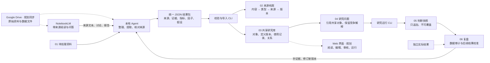

# 因果研究台（Personal Research OS）

面向个人长期投研的共享研究库：保存原始依据，连接证据、指标、因子与因果假设，冻结每次判断，之后用实际结果复盘。

**先看对象和关系，再看研究问题。** 一个指标或因子可以被多个主题引用；批次只负责记录处理过程，不划分数据所有权。

## 从哪里开始

| 我想做什么 | 入口 |
|---|---|
| 查已有来源、证据、指标和因子，看它们如何关联 | [共享研究库](03-library/README.md) |
| 看正在研究的问题、情景和历史判断 | [研究问题](04-research/README.md) |
| 找尚未核验的说法和相互矛盾的证据 | [待核验与冲突](04-research/01-pending.md) |
| 放入新材料或查看待导入结果包 | [待处理区](01-inbox/README.md) |
| 查文件格式、处理规范与首轮实践 | [使用指南](00-guide/README.md) |

## 数据流与模块分工



| 模块 | 职责与边界 |
|---|---|
| Drive / 来源档案 | 保存依据；本地按内容和类型归档，Drive 自动同步尚未实现 |
| NotebookLM | 辅助阅读、问答；输出是待核验材料，不自动成为事实 |
| 本地 Agent | 核对原始材料，生成 JSON 结果包；目前由 Agent 编排，不是全格式自动解析器 |
| 校验与导入 CLI | 检查格式、哈希、摘录、数值、引用；归档原文和结果，幂等入库 |
| 共享研究库 | 相同定义复用一个对象；口径/机制变化产生版本；不同研究保留各自的观测与评估 |
| 研究问题视图 | 引用指标和因子，组织情景、支持证据、反证和缺口；主题不复制共享定义 |
| 运行与复盘 | 冻结数据和模型版本；目前实现固定研究门禁、草稿快照和数据审计，未来市场结果尚未验证 |
| Web | 未来统一操作入口，尚未实现；当前可直接阅读生成的 Markdown |

## 文件夹为什么这样编号

```text
00-guide/                 说明：流程、契约、设计、迁移记录
01-inbox/                 接收：待处理资料与待导入结果包
02-sources/               存证：正式来源，按内容主题再按文件类型
03-library/               共享：跨主题对象和关系
  01-sources/             来源阅读视图
  02-evidence/            证据、审核记录、上下游关联
  03-metrics/             指标定义及不同时期观测
  04-factors/             因子机制及不同研究的评估
  05-relations/           因果假设、支持/反驳关系
  06-catalog/             导入索引（后台）
  07-models/              模型定义与主题模板（后台）
  08-packages/            规范化 JSON 结果包（后台）
04-research/              研究：问题视图、待核验清单、历史报告阅读副本
05-runs/                  冻结：不可覆盖的运行快照
06-reviews/               复盘：不可覆盖的审计与结果归因
07-exports/               交付：外部工具和人工阅读用导出物
90-system/                系统：代码、契约、配置、测试、运行数据库
```

编号用于导航，**不表示数据只能从小编号单向流动**。共享指标可以服务多个研究，复盘产生新的资料和版本，再回到共享库。

JSON 保存可迁移的结构化结果；SQLite 提供跨对象查询；Markdown 从已导入结果生成供人阅读。不要分别手工维护三份内容。历史来源、包和快照不能覆盖，数据调整生成新版本。

## 使用流程

1. 将资料与结果包放到 `01-inbox/`，按[处理结果包规范](00-guide/processing-pipeline.md)整理。
2. 执行校验与导入，正式来源自动进入 `02-sources/`。
3. 刷新共享阅读视图，从[研究库](03-library/README.md)检查引用、缺口和冲突。
4. 运行研究，冻结快照；后续复盘必须引用独立结果，不能事后改写判断。

```bash
python3 90-system/03-scripts/research.py validate 01-inbox/notebooklm-lidang-2026-09-16-v1/package.json
python3 90-system/03-scripts/research.py import 01-inbox/notebooklm-lidang-2026-09-16-v1/package.json
python3 90-system/03-scripts/research.py library
python3 90-system/03-scripts/research.py run package.lidang.2026-09-16.v1
python3 90-system/03-scripts/research.py status
python3 -m unittest discover -s 90-system/04-tests -v
```

来源、结果包和运行数据库默认留在本机；只克隆 Git 不会获得这些文件。校验通过不代表研究结论正确，因子、因果假设和情景仍待人工审核，不自动执行交易。

首轮真实输入与局限见[NotebookLM 实践](00-guide/first-run-notebooklm.md)，对象共享规则见[共享研究库设计](00-guide/shared-library-design.md)。
